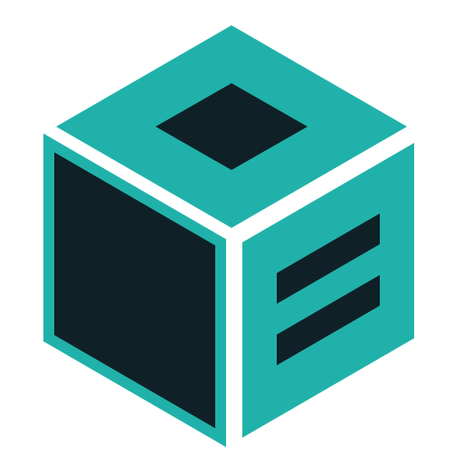
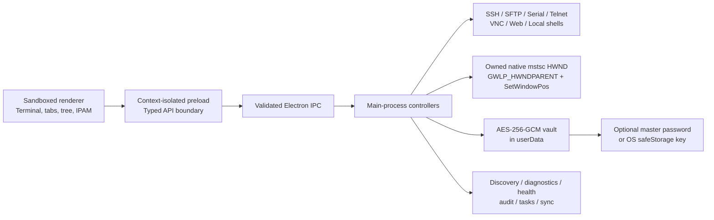

# CyberGrid

> A fast, secure command center for terminal, remote desktop, infrastructure inventory, and day-two systems operations.

<p align="center">
  
</p>

[](https://www.electronjs.org/)
[](https://www.typescriptlang.org/)
[](https://nodejs.org/)
[](LICENSE)
[](https://github.com/KurlyDeer/cybergrid/actions/workflows/build.yml)

CyberGrid consolidates the daily tools of a senior systems administrator into one focused, high-density desktop workspace. Its compact mRemote-style connection tree, edge-to-edge session tabs, encrypted connection management, file transfer, discovery, IPAM, diagnostics, automation, and operational documentation are designed for fast keyboard-driven administration without requiring a central cloud service.

## Version 1.3.8 — Themed UI & Resource Hardening

- **In-app updater dialogs:** update availability, restart, up-to-date, development-build and interactive error messages follow the active palette. Passive update notices disappear after three seconds. Native file pickers, exit confirmations and emergency crash dialogs remain native.
- **Six presets:** Midnight, Snowblind, Vampire, Deep Sea, Matrix and Neon Synth, plus a separate custom palette. Older saved names migrate automatically (including Monokai → Neon Synth); fonts and custom colors are retained.
- **Docked sidebar footer:** collapsible Asset Inventory and Vault Lock stay below the independently scrolling connection tree.
- **Lifecycle and IPC hardening:** only known top-level local pages can invoke the typed preload bridge. Terminal/GPU resources are disposed before disconnect IPC completes; detached listeners are removed, late closed-session events are discarded, and pre-attachment queues are bounded. RDP geometry changes coalesce over 150 ms.

See [the v1.3.8 audit notes](docs/AUDIT-v1.3.8.md) for tests, scope and remaining limitations. CyberGrid uses vanilla TypeScript—not React—and this update adds no UI framework.

## Why CyberGrid

Traditional administrator workflows often span mRemoteNG for connection trees, PuTTY for SSH, separate SFTP and serial clients, browser bookmarks, spreadsheets for IP allocation, and scripts for repetitive operations. CyberGrid provides one local-first workspace for those responsibilities:

- A single searchable connection tree instead of disconnected session lists.
- A consistent tab and split-grid experience across terminal and management protocols.
- An encrypted vault for credentials, metadata, notes, snippets, and configuration snapshots.
- Built-in migration from mRemoteNG, PuTTY, CSV, and CyberGrid team vaults.
- Discovery, health badges, diagnostics, and CMDB fields beside the connections they describe.
- Local storage and OS-protected automatic unlock, with an optional user-managed master password.

CyberGrid does not transmit vault data to a hosted CyberGrid service and includes no automatic product telemetry. Connections, preferences, workspaces, audit transcripts, and vault files remain on the workstation unless an operator explicitly exports or transfers them. **Help → Report a Bug** is opt-in: Send Report opens a reviewed, redacted diagnostic excerpt in a public GitHub issue draft. Nothing is posted automatically.

The v1.3.6 identity uses a sharp isometric hexagon with deep navy (`#0F2027`), teal (`#20B2AA`), and transparent channels. `src/assets/logo.svg` is the artwork source for the application, Welcome and vault screens, tray, window icons, executable, and installer. Every clean build runs `scripts/generate-brand-assets.cjs` to regenerate `build/icon.ico` (16, 24, 32, 48, 64, 128, and 256 pixels) and `build/icon.png` directly from that SVG.

## Version 1.3.7 — Diagnostics & Community

Open **Tools → Global Diagnostics** without saving a connection or unlocking a vault. The left-hand Network, Security, and Hardware tabs contain:

| Tool | Behavior | Limits |
| --- | --- | --- |
| TCP Port Bouncer | Measures one TCP handshake and closes immediately; reports error codes such as `ECONNREFUSED` or `ETIMEDOUT` | 2-second deadline including name resolution; not a port forwarder or authentication test |
| Native DNS Query | Uses a per-request `dns.promises.Resolver`, optional DNS server IP, and `resolveAny` | Bypasses OS name-resolution cache, not upstream DNS cache; ANY may be restricted or incomplete; 5-second deadline |
| SSL / TLS Inspector | Retrieves subject, issuer, validity, SANs, trust status, and fingerprint; highlights expiration within 30 days | Accepts untrusted certificates for this inspection only, sends no application credentials, and closes after inspection; 5-second deadline |
| MAC OUI Lookup | Accepts colon, hyphen, dotted, and plain MAC formats; performs an offline lookup | Small Cisco/Dell/HP/Apple subset; unknown, randomized, and multicast addresses are identified honestly, not guessed |

Each tool's **?** button exposes keyboard-accessible **What it does**, **When to use it**, and **Why it helps** notes. Checks are on demand, cancellable, and limited to one per application window and four across the app. Results stay in memory in that window. Only test systems you are authorized to administer.

### Reviewed bug reports

Use **Help → Report a Bug**, optionally describe the problem, inspect the outgoing preview, then click **Send Report**. A browser opens the GitHub draft; you still need to sign in and submit the issue yourself. The report includes app version, OS/system version, process memory use, and recent main-process errors. It does not collect terminal transcripts or read vault credentials.

The error buffer is capped at 50 lines and held in memory for the current app process. Common secret patterns, IP addresses, and personal user paths are redacted before buffering and again before reporting. Redaction is best-effort: review all content for confidential information. The draft is carried in a URL and may be retained by GitHub, your browser/history, or organizational network tooling. Closing the modal sends nothing.

Windows limits Electron browser-launch URLs to 2081 characters. CyberGrid keeps the outgoing URL below 2000 characters, labels shortened excerpts, and provides **Copy Full Report** for the full redacted content. Review it before pasting; the clipboard may persist in OS history. [Electron browser-launch limits](https://www.electronjs.org/docs/latest/api/shell#shellopenexternalurl-options), [Node DNS resolver behavior](https://nodejs.org/api/dns.html#class-dnspromisesresolver).

The offline OUI subset is drawn from the [IEEE MA-L registry](https://standards-oui.ieee.org/oui/oui.csv), checked on 2026-09-05. An OUI indicates an assignment, not a device's authenticity or exact model.

See [CONTRIBUTING.md](CONTRIBUTING.md) for setup, tests, security expectations, and the PR workflow. GitHub bug and feature forms and a PR checklist are included in `.github/`.

## Version 1.3.6 — Settings, Branding & Live Health

- **Settings validation:** Line Height accepts hundredths such as `1.18`. Invalid numbers show an inline error and reveal the relevant Settings tab, rather than silently blocking Apply. Themes apply immediately, persist locally, and roll back visually if saving fails. The stored line-height range is `0.5–3.0`; xterm.js renders values below `1.0` at its supported minimum.
- **TCP service health:** saved SSH, RDP, web, and other TCP connections are checked with a 1500 ms deadline, eight concurrent sockets, and a 45-second default interval. Port overrides are honored. Green means the service port is reachable, red means unreachable, and gray means pending or not applicable. Hover a green dot for TCP connection latency; this is not ICMP ping or an authentication test.
- **Broadcast Input:** the top status-bar toggle sends keyboard input to connected SSH, Serial, Telnet, RAW, and local terminals in the current workspace. ON is visibly highlighted with the target count; hover to inspect targets. Interactive login prompts and disconnected sessions are excluded. Use Tools → Broadcast Targets for group filtering. Broadcast commands affect multiple systems—review targets before typing.

## Version 1.3.5 — Terminal Workflow

- **GPU-first terminals:** WebGL renders both main-window and detached terminals, with an explicit Canvas fallback when WebGL fails or loses its context. Terminal input flows directly over IPC; this application uses vanilla TypeScript, not React. Actual latency still depends on network, host, and GPU performance.
- **Reconnect in place:** closed SSH tabs retain their output. Press **Space** to clear the screen and reconnect in the same tab. Saved profiles are resolved through the vault again; ad-hoc credentials remain session-local. Close the tab to cancel.
- **Session Tools → Session Output:** use **Start Session Log** to record received SSH bytes to `Documents/CyberGrid_Logs/*.log`. Stop flushes and closes the file; disconnect and application exit also flush it. Logging is opt-in for each session. These files are unencrypted and can contain sensitive output—protect, retain, and delete them according to your organization's policy.
- **Copy All Output:** copies the active xterm buffer, including retained scrollback (up to 10,000 lines), preserving wrapped lines. It does not recover output that has already scrolled out of the buffer.
- **Cisco macros:** Routing, Switching, Diagnostics, and Configuration groups provide interface, route, VLAN, neighbor, logging, and support commands. Model information stays in Session Tools, never over terminal text.
- **Backup location:** choose **Tools → Settings → General → Backup Directory Path → Browse...**, then save. The default is `Documents/CyberGrid_Backups`; one-click switch snapshots use the configured directory.
- **Welcome dashboard:** a lightweight landing page with New Connection, repository, and public documentation links replaces the idle Welcome terminal.

## Architecture

- **Native RDP docking:** CyberGrid tracks the spawned mstsc PID, finds its `TscShellContainerClass` HWND, strips native chrome, uses Win32 `SetParent`, and updates the docked viewport on resize. Behavior depends on Windows and Remote Desktop client versions.
- **Reliable embedded web consoles:** the isolated Web Console partition accepts appliance self-signed HTTPS certificates while the main application, updater, and unrelated Electron content retain normal certificate validation.
- **Per-user runtime storage:** vault, preferences, workspace, RDP runtime files, and automatic audit transcripts live under Electron `userData` (`%APPDATA%\CyberGrid` on Windows). Config backups use the selected backup folder, and opt-in session logs use Documents. Runtime data is never written into the installation directory.
- **Minimal connection editor:** saved connections expose only name, endpoint, protocol, domain, username, password, and an optional port override. Existing advanced metadata remains intact when a connection is edited.
- **Centralized Global Options:** startup, exit protection, terminal rendering, SSH keep-alives and password retries, RDP Smart Sizing, color depth, sound redirection, vault protection, proxy settings, and external-tool paths live in one tabbed modal.
- **Intentional tab behavior:** ordinary opens reuse a matching profile or endpoint tab; the tab context menu remains the explicit path for duplicate sessions.
- **Vendor-aware network operations:** the non-overlapping 300-pixel Session Tools drawer detects Cisco IOS, FortiOS, HP ProCurve, or generic devices and offers manual Auto/Cisco/FortiOS/Generic command modes.
- **Native desktop navigation:** the File, Edit, View, Tools, Window, and Help menus expose the complete keyboard-driven administration workflow.

## Core Features

| Area | Capabilities |
| --- | --- |
| Multi-protocol sessions | Native HWND-docked Windows RDP with Smart Sizing, SSH/SFTP with opt-in legacy switch KEX and Oakley DH compatibility, embedded VNC, serial/COM, Telnet, RAW TCP, self-signed-appliance-aware isolated web consoles, and local PowerShell/CMD/WSL terminals |
| Connection management | High-density mRemote-style tree, essential-only connection editor, multi-tier groups, favorites, fuzzy search, endpoint tab de-duplication, explicit duplicate tabs, multi-select bulk actions, connection duplication, custom icons, and folder inheritance |
| Global options | Central startup and exit behavior, terminal fonts/colors/line height, SSH keep-alive and retry policy, RDP sizing/color/audio defaults, vault auto-lock, proxy configuration, and external-tool mappings |
| Encrypted vault | Zero-telemetry AES-256-GCM local encryption, scrypt key derivation, optional master password, OS-protected automatic key, auto-lock, TOTP generation, and environment-variable credential tokens |
| Discovery and CMDB | Private-subnet scanning, administration-port detection, DNS/MAC/OUI fingerprinting, vendor and OS hints, automatic icons, asset tags, rack/site data, SLA metadata, and health badges |
| Subnet IPAM | A 256-address `/24` grid with saved, online, offline, and unassigned states plus direct SSH/RDP and vault-entry actions |
| Operations | Broadcast terminal with explicit target filters, tagged command snippets, variable substitution, notes, SFTP transfers, screenshots, external tools, and a vendor-aware flex Session Tools drawer for Cisco/Fortinet/HP snapshots, diagnostics, and macros |
| Team and migration | mRemoteNG XML, PuTTY Registry, CSV, and AES-256-GCM `.cgvault` import/export with `${TOKEN}` substitution for personal credentials |
| Enterprise integration | Pre/post-connect tasks, VPN/script orchestration, AD/LDAP inventory sync, VMware inventory pull, and Hyper-V inventory support |
| Recovery and audit | Per-session raw/plain-text transcripts, automatic saved-workspace restore, and a password-encrypted offline disaster-recovery HTML runbook |
| Desktop productivity | System tray favorites, opt-in close-to-tray behavior, normal taskbar minimization, 2×2 terminal layout, `Ctrl+K` command palette, `Alt+Space` global launcher, offline F1 Help Center, and packaged-app update notifications |

## Install CyberGrid on Windows

CyberGrid v1.3.7 produces two x64 Windows packages in `dist/`:

- `CyberGrid-1.3.7-setup-x64.exe` — guided NSIS installer with selectable installation directory, desktop shortcut, Start menu shortcut, and uninstaller.
- `CyberGrid-1.3.7-portable-x64.exe` — self-contained portable executable.

Download the preferred package from the repository's [Releases page](https://github.com/KurlyDeer/cybergrid/releases). For the installer, run the setup executable and follow the wizard. For the portable build, place the executable in a user-writable tools directory and launch it directly.

### Windows SmartScreen

CyberGrid v1.3.7 packages may display a Windows SmartScreen **Unknown Publisher** warning until the project has an established code-signing reputation. Download CyberGrid only from this repository's Releases page, verify its SHA-256 checksum, and then select **More info → Run anyway** if you trust the verified package. Never bypass SmartScreen for an executable from an unverified mirror or unexpected message attachment.

### Verify a release download

Calculate the installer checksum in PowerShell and compare the complete value with the SHA-256 value published in the corresponding GitHub release notes:

```powershell
Get-FileHash -LiteralPath ".\CyberGrid-1.3.7-setup-x64.exe" -Algorithm SHA256
```

For an additional reputation check, upload the verified installer to [VirusTotal](https://www.virustotal.com/gui/home/upload) if your organization's policy permits public malware-analysis submissions. A detection result is supplementary evidence, not a replacement for matching the release checksum and confirming the download source. Do not upload private or internally customized builds.

The first launch creates local application data under Electron's per-user `userData` location. On Windows this is normally `%APPDATA%\CyberGrid`. The vault, preferences, workspace snapshot, automatic audit logs, security key material, and temporary RDP files remain there. Optional logs and configuration backups use the Documents locations described above. No runtime database or configuration is written to the installation directory.

Installed builds check the repository's published release metadata after startup without delaying the initial window. When a newer release is available, CyberGrid downloads it in the background and presents an in-app restart prompt after checksum verification completes.

### First launch

1. Choose whether to enable a master password in **Settings → Security**.
2. Add a connection with the **+** button or import an existing tree from **Import / Export**.
3. Double-click a saved node, use `Ctrl+K`, or enter a URI such as `ssh://admin@server.example.com:22` in Quick Connect.
4. Press `F1` for the offline help center and `Ctrl+/` for keyboard shortcuts.

## Run from Source

### Requirements

- Windows 10/11 x64 for the complete v1.3.7 desktop feature set and native HWND-docked RDP integration.
- Node.js 22 LTS and npm.
- Git.
- Native build prerequisites supported by Electron Builder if a prebuilt native dependency is unavailable.

```powershell
git clone https://github.com/KurlyDeer/cybergrid.git
cd cybergrid
npm install
npm run build
npm start
```

Use `npm ci` instead of `npm install` for a lockfile-exact CI or release build.

## Build Commands

```powershell
# Static TypeScript verification
npm run typecheck

# Terminal/log regression tests (UI test uses mock IPC, no real credentials)
node scripts/test-session-log.cjs
node scripts/test-terminal-renderer.cjs
node scripts/test-health-preferences.cjs
node scripts/test-diagnostics-reports.cjs
# Run after npm run build; rebuild again before packaging to remove test assets
npx electron scripts/test-terminal-ui.cjs

# Clean and bundle the main, preload, and renderer entrypoints
npm run build

# Generate the Windows NSIS installer and portable executable
npx electron-builder --win

# Regenerate SVG-matched Windows icon resources
powershell -ExecutionPolicy Bypass -File .\scripts\generate-brand-assets.ps1

# Clean dist, build, and package x64 Windows artifacts without publishing
npm run dist:win
```

Bundled application assets are written to `build/`. Installer and portable artifacts are written only to `dist/`. Both directories are intentionally ignored by Git.

## Release Automation

The Windows workflow in `.github/workflows/build.yml` runs on pushes to `main` and version tags matching `v*.*.*`. It installs the lockfile with Node.js 22, rebuilds native Electron modules during `npm ci`, compiles the application, and publishes the NSIS and portable artifacts through Electron Builder using GitHub's scoped Actions token.

Local `npx electron-builder --win` builds never publish unless a publish mode and release token are supplied explicitly.

### Authenticode placeholders

Electron Builder is configured to edit/sign Windows executables while allowing unsigned community builds (`forceCodeSigning: false`). Future signed CI builds should provide the certificate only through protected secrets—never through committed files:

```powershell
$env:WIN_CSC_LINK = "<base64-pfx-or-secure-certificate-url>"
$env:WIN_CSC_KEY_PASSWORD = "<certificate-password>"
npx electron-builder --win
```

The `signtoolOptions` certificate fields are intentionally `null` placeholders. Setting `WIN_CSC_LINK` and `WIN_CSC_KEY_PASSWORD` lets Electron Builder resolve an Authenticode identity without storing certificate material in this repository.

## Architecture



The renderer has no direct Node.js access. The preload exposes a narrow typed API, and main-process IPC handlers validate sender identity and untrusted input before reaching protocol, filesystem, vault, or process-launch functionality. Heavy native dependencies are loaded only when their corresponding feature is requested.

### Codebase structure

```text
cybergrid/
├── .github/workflows/build.yml   # Windows CI packaging
├── scripts/build.cjs             # esbuild bundling pipeline
├── scripts/generate-brand-assets.ps1 # deterministic Windows icon generator
├── src/
│   ├── assets/                   # enterprise SVG branding source
│   ├── main/                     # Electron lifecycle, vault, protocols, discovery, audit
│   ├── renderer/                 # Main command center and compact quick launcher
│   └── shared/ipc.ts             # Shared IPC contracts and application types
├── package.json                  # Dependencies, scripts, and electron-builder config
└── tsconfig.json                 # Strict Electron/Node TypeScript configuration
```

## Security Model

- Vault contents are authenticated and encrypted with AES-256-GCM.
- Master-password keys use scrypt with a unique random salt.
- Automatic unlock stores a random vault key through Electron `safeStorage`; insecure Linux basic-text storage is rejected.
- Renderer processes use sandboxing, context isolation, disabled Node integration, navigation restrictions, and validated IPC senders.
- Workspace restore persists profile identifiers and layout only—not decrypted credentials.
- Disaster-recovery HTML exports encrypt the complete runbook payload with AES-256-GCM and PBKDF2-SHA256.
- Private keys are read only when required for a requested SSH connection and are not copied into source control.

Do not commit `.env`, private keys, database files, vault exports, logs, or packaged executables. The supplied `.gitignore` rejects these classes of files by default. Report suspected vulnerabilities privately to the repository maintainers before opening a public issue.

## Contributing

Contributions should be small, reviewable, and safe for administrators to run on production workstations.
Start with the complete [contributor guide](CONTRIBUTING.md) and use the repository's issue/PR templates.

1. Open an issue describing the problem, intended behavior, and platform impact.
2. Fork the repository and create a focused branch.
3. Preserve the context-isolated IPC boundary and validate all renderer-provided data in the main process.
4. Never add real infrastructure addresses, credentials, vaults, transcripts, private keys, or customer configuration samples.
5. Run `npm run typecheck` and `npm run build` before submitting a pull request.
6. Describe manual verification, security implications, and packaging impact in the pull request.

For protocol or native-module changes, include Windows verification and document any platform-specific behavior.

## License

CyberGrid is open-source software released under the [MIT License](LICENSE).
