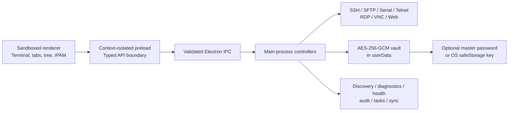

# CyberGrid

> A fast, secure command center for terminal, remote desktop, infrastructure inventory, and day-two systems operations.

[](https://www.electronjs.org/)
[](https://www.typescriptlang.org/)
[](https://nodejs.org/)
[](LICENSE)
[](https://github.com/KurlyDeer/cybergrid/actions/workflows/build.yml)

CyberGrid consolidates the daily tools of a senior systems administrator into one focused desktop workspace. It combines tabbed terminals, remote desktop launch and lifecycle tracking, file transfer, encrypted connection management, network discovery, IPAM, diagnostics, automation, and operational documentation without requiring a central cloud service.

## Why CyberGrid

Traditional administrator workflows often span mRemoteNG for connection trees, PuTTY for SSH, separate SFTP and serial clients, browser bookmarks, spreadsheets for IP allocation, and scripts for repetitive operations. CyberGrid provides one local-first workspace for those responsibilities:

- A single searchable connection tree instead of disconnected session lists.
- A consistent tab and split-grid experience across terminal and management protocols.
- An encrypted vault for credentials, metadata, notes, snippets, and configuration snapshots.
- Built-in migration from mRemoteNG, PuTTY, CSV, and CyberGrid team vaults.
- Discovery, health badges, diagnostics, and CMDB fields beside the connections they describe.
- Local storage and OS-protected automatic unlock, with an optional user-managed master password.

CyberGrid does not transmit vault data to a hosted CyberGrid service. Connections, preferences, workspaces, audit transcripts, and vault files remain on the workstation unless an operator explicitly exports or transfers them.

## Core Features

| Area | Capabilities |
| --- | --- |
| Multi-protocol sessions | SSH terminals, SFTP, native Windows RDP lifecycle integration, embedded VNC, serial/COM, Telnet, RAW TCP, and isolated HTTP/HTTPS management tabs |
| Connection management | Multi-tier groups, application stacks, locations, favorites, fuzzy search, global quick launcher, custom icons, per-node terminal overrides, and folder inheritance |
| Encrypted vault | AES-256-GCM authenticated encryption, scrypt key derivation, optional master password, OS-protected automatic key, auto-lock, TOTP generation, and environment-variable credential tokens |
| Discovery and CMDB | Private-subnet scanning, administration-port detection, DNS/MAC/OUI fingerprinting, vendor and OS hints, automatic icons, asset tags, rack/site data, SLA metadata, and health badges |
| Subnet IPAM | A 256-address `/24` grid with saved, online, offline, and unassigned states plus direct SSH/RDP and vault-entry actions |
| Operations | Broadcast terminal with explicit target filters, tagged command snippets, variable substitution, notes, switch configuration snapshots, SFTP transfers, diagnostics, screenshots, and external tools |
| Team and migration | mRemoteNG XML, PuTTY Registry, CSV, and AES-256-GCM `.cgvault` import/export with `${TOKEN}` substitution for personal credentials |
| Enterprise integration | Pre/post-connect tasks, VPN/script orchestration, AD/LDAP inventory sync, VMware inventory pull, and Hyper-V inventory support |
| Recovery and audit | Per-session raw/plain-text transcripts, automatic saved-workspace restore, and a password-encrypted offline disaster-recovery HTML runbook |
| Desktop productivity | System tray favorites, minimize-to-tray, 2×2 terminal layout, `Ctrl+K` command palette, `Alt+Space` global launcher, offline F1 Help Center, and packaged-app update notifications |

## Install CyberGrid on Windows

CyberGrid v1.0.0 produces two x64 Windows packages in `dist/`:

- `CyberGrid-1.0.0-setup-x64.exe` — guided NSIS installer with selectable installation directory, desktop shortcut, Start menu shortcut, and uninstaller.
- `CyberGrid-1.0.0-portable-x64.exe` — self-contained portable executable.

Download the preferred package from the repository's [Releases page](https://github.com/KurlyDeer/cybergrid/releases). For the installer, run the setup executable and follow the wizard. For the portable build, place the executable in a user-writable tools directory and launch it directly.

### Windows SmartScreen

CyberGrid v1.0.0 packages may display a Windows SmartScreen **Unknown Publisher** warning until the project has an established code-signing reputation. Download CyberGrid only from this repository's Releases page, verify its SHA-256 checksum, and then select **More info → Run anyway** if you trust the verified package. Never bypass SmartScreen for an executable from an unverified mirror or unexpected message attachment.

### Verify a release download

Calculate the installer checksum in PowerShell and compare the complete value with the SHA-256 value published in the corresponding GitHub release notes:

```powershell
Get-FileHash -LiteralPath ".\CyberGrid-1.0.0-setup-x64.exe" -Algorithm SHA256
```

For an additional reputation check, upload the verified installer to [VirusTotal](https://www.virustotal.com/gui/home/upload) if your organization's policy permits public malware-analysis submissions. A detection result is supplementary evidence, not a replacement for matching the release checksum and confirming the download source. Do not upload private or internally customized builds.

The first launch creates local application data under Electron's per-user `userData` location. On Windows this is normally `%APPDATA%\CyberGrid`. No vault or database is written to the installation directory.

Installed builds check the repository's published release metadata after startup without delaying the initial window. When a newer release is available, CyberGrid downloads it in the background and presents an in-app restart prompt after checksum verification completes.

### First launch

1. Choose whether to enable a master password in **Settings → Security**.
2. Add a connection with the **+** button or import an existing tree from **Import / Export**.
3. Double-click a saved node, use `Ctrl+K`, or enter a URI such as `ssh://admin@server.example.com:22` in Quick Connect.
4. Press `F1` for the offline help center and `Ctrl+/` for keyboard shortcuts.

## Run from Source

### Requirements

- Windows 10/11 x64 for the complete v1.0.0 desktop feature set and RDP integration.
- Node.js 22 LTS and npm.
- Git.
- Native build prerequisites supported by Electron Builder if a prebuilt native dependency is unavailable.

```powershell
git clone https://github.com/KurlyDeer/cybergrid.git
cd cybergrid
npm install
npm run build
npm start
```

Use `npm ci` instead of `npm install` for a lockfile-exact CI or release build.

## Build Commands

```powershell
# Static TypeScript verification
npm run typecheck

# Clean and bundle the main, preload, and renderer entrypoints
npm run build

# Generate the Windows NSIS installer and portable executable
npx electron-builder --win

# Clean dist, build, and package x64 Windows artifacts without publishing
npm run dist:win
```

Bundled application assets are written to `build/`. Installer and portable artifacts are written only to `dist/`. Both directories are intentionally ignored by Git.

## Release Automation

The Windows workflow in `.github/workflows/build.yml` runs on pushes to `main` and version tags matching `v*.*.*`. It installs the lockfile with Node.js 20, rebuilds native Electron modules during `npm ci`, compiles the application, and publishes the NSIS and portable artifacts through Electron Builder using GitHub's scoped Actions token.

Local `npx electron-builder --win` builds never publish unless a publish mode and release token are supplied explicitly.

## Architecture



The renderer has no direct Node.js access. The preload exposes a narrow typed API, and main-process IPC handlers validate sender identity and untrusted input before reaching protocol, filesystem, vault, or process-launch functionality. Heavy native dependencies are loaded only when their corresponding feature is requested.

### Codebase structure

```text
cybergrid/
├── .github/workflows/build.yml   # Windows CI packaging
├── scripts/build.cjs             # esbuild bundling pipeline
├── src/
│   ├── main/                     # Electron lifecycle, vault, protocols, discovery, audit
│   ├── renderer/                 # Main command center and compact quick launcher
│   └── shared/ipc.ts             # Shared IPC contracts and application types
├── package.json                  # Dependencies, scripts, and electron-builder config
└── tsconfig.json                 # Strict Electron/Node TypeScript configuration
```

## Security Model

- Vault contents are authenticated and encrypted with AES-256-GCM.
- Master-password keys use scrypt with a unique random salt.
- Automatic unlock stores a random vault key through Electron `safeStorage`; insecure Linux basic-text storage is rejected.
- Renderer processes use sandboxing, context isolation, disabled Node integration, navigation restrictions, and validated IPC senders.
- Workspace restore persists profile identifiers and layout only—not decrypted credentials.
- Disaster-recovery HTML exports encrypt the complete runbook payload with AES-256-GCM and PBKDF2-SHA256.
- Private keys are read only when required for a requested SSH connection and are not copied into source control.

Do not commit `.env`, private keys, database files, vault exports, logs, or packaged executables. The supplied `.gitignore` rejects these classes of files by default. Report suspected vulnerabilities privately to the repository maintainers before opening a public issue.

## Contributing

Contributions should be small, reviewable, and safe for administrators to run on production workstations.

1. Open an issue describing the problem, intended behavior, and platform impact.
2. Fork the repository and create a focused branch.
3. Preserve the context-isolated IPC boundary and validate all renderer-provided data in the main process.
4. Never add real infrastructure addresses, credentials, vaults, transcripts, private keys, or customer configuration samples.
5. Run `npm run typecheck` and `npm run build` before submitting a pull request.
6. Describe manual verification, security implications, and packaging impact in the pull request.

For protocol or native-module changes, include Windows verification and document any platform-specific behavior.

## License

CyberGrid is open-source software released under the [MIT License](LICENSE).
